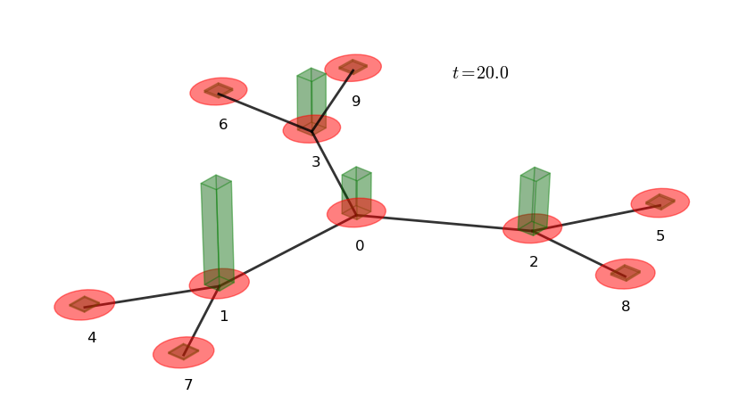

=====================
:file:`1P_3cayley.py`
=====================

Description
------------

.. |3-cayley-graph| image:: 3cayley.png
    :width: 300pt

+-----------------------+-------------------------------------------------------------------------------------+
|                       |This example propagates a 1 particle continuous-time quantum walk on a 3-cayley tree.|
|   |3-cayley-graph|    |                                                                                     |
|                       |Amongst the features used, it illustrates:                                           |
|                       |    *   the use of the chebyshev algorithm, with eigenvalues pre-set                 |
|                       |    *                                                                                |
|                       |        adding a diagonal defect of amplitude 3 to node 0.\                          |
|                       |        This acts to alter the original Hamiltonian, \                               |
|                       |        by the addition of a diagonal 'disorder' matrix :math:`\Gamma`; \            |
|                       |        :math:`H = H_0 + \Gamma` where :math:`\Gamma = 3|0\rangle\langle 0|`.        |
|                       |                                                                                     |
|                       |    *   creating node handles to watch the probability at specified nodes            |
|                       |    *   various plotting abilities:                                                  |
|                       |            - probability vs node plots                                              |
|                       |            - probability vs time plots                                              |
|                       |            - graph plots                                                            |
+-----------------------+-------------------------------------------------------------------------------------+

Output
------------

Required Files
-----------------
    * :download:`Adjacency matrix </../graphs/cayley/3-cayley.txt>`

Source Code
--------------------------------------------------------
[:download:`Download source code </../examples/1P_3cayley.py>`]

.. literalinclude:: /../examples/1P_3cayley.py
    :linenos:

