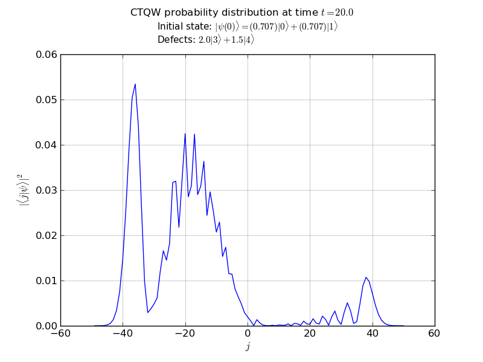

==================
:file:`1P_line.py`
==================

Description 
-----------

This example propagates a 1 particle continuous-time quantum walk on an infinite line

Amongst the features used, it illustrates:
	*   recieving command line options using PETSc 
	*   the use of the chebyshev algorithm
			- setting the EigSolver tolerance
	*   adding a diagonal defects to various nodes
	*   creating node handles to watch the probability at specified nodes
	*   various plotting abilities:
	        - probability vs node plots
	        - probability vs time plots

Output
------------

Source Code
--------------------------------------------------------
[:download:`Download source code </../examples/1P_line.py>`]

.. literalinclude:: /../examples/1P_line.py
    :linenos:

