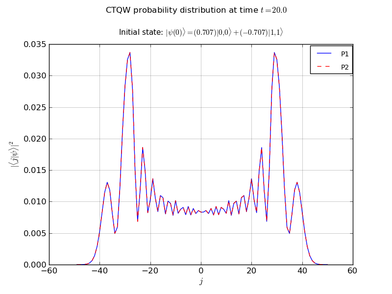

==================
:file:`2P_line.py`
==================

Description 
-----------

This example propagates a 2 particle continuous-time quantum walk on an infinite line

Amongst the features used, it illustrates:
    *   recieving command line options using PETSc 
    *   the use of the chebyshev algorithm
            - setting the EigSolver tolerance, as well as the minimum eigenvalue
    *   adding a diagonal defects to various nodes
    *   same-node interactions between particles
    *   creating node handles to watch the probability at specified nodes
    *   creating entanglement handles to watch the entanglement 
    *   various plotting abilities:
            - probability vs node plots
            - probability vs time plots
            - entanglement vs time plot
    *   Exporting the final state to a PETSc binary vector file

Output
------------

Source Code
-------------

[:download:`Download source code </../examples/2P_line.py>`]

.. literalinclude:: /../examples/2P_line.py   
    :linenos:  

.. only:: draft

    +---------------------------------------------------------------+-------------------------------+
    |  Source Code [:download:`download </../examples/2P_line.py>`] |             Output            |
    +---------------------------------------------------------------+-------------------------------+
    |                                                               | .. image:: 2p_line_plot.png   |
    |                                                               |    :width: 360pt              |
    | .. literalinclude:: /../examples/2P_line.py                   |                               |
    |    :linenos:                                                  |                               |
    |                                                               | .. image:: 2p_line_nodes.png  |
    |                                                               |    :width: 360pt              |
    |                                                               |                               |
    |                                                               | .. image:: 2p_line_ent.png    |
    |                                                               |     :width: 360pt             |
    +---------------------------------------------------------------+-------------------------------+

