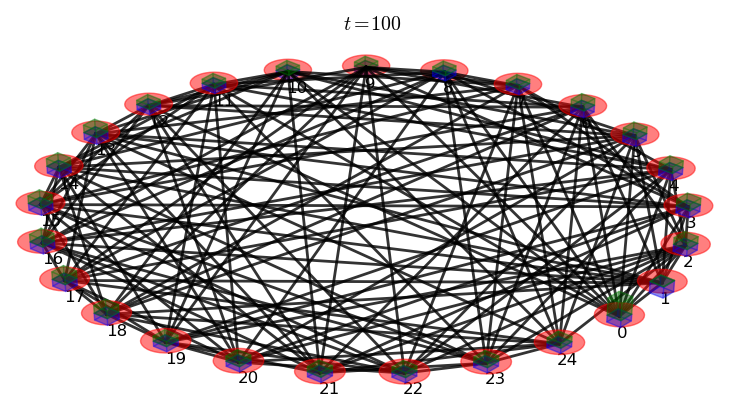

==================
:file:`2P_sr.py`
==================

Description 
-----------

This example propagates a 2 particle continuous-time quantum walk on the first member of the strongly regular :math:`(25,12,5,6)` family of graphs.

Amongst the features used, it illustrates:
	*   the use of the Krylov propagation algorithm
	*   various plotting abilities:
	        - probability vs node plot
	        - probability and graph plot

Output
------------

.. image:: 2p_sr_plot.png
    :width: 360pt

Required Files
-----------------
	* :download:`Adjacency matrix </../graphs/strong-regular-25-12-5-6/1.txt>`

Source Code
--------------------------------------------------------
[:download:`Download source code </../examples/2P_sr.py>`]

.. literalinclude:: /../examples/2P_sr.py
    :linenos:

