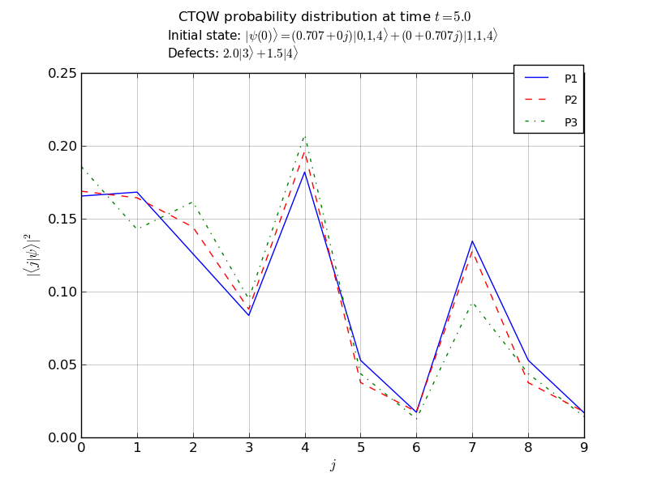
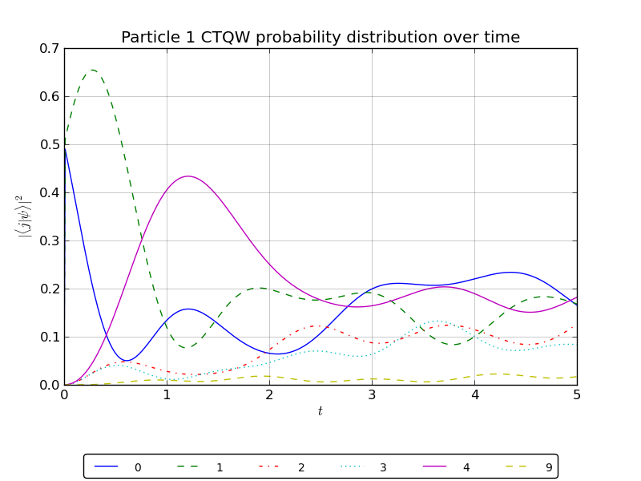
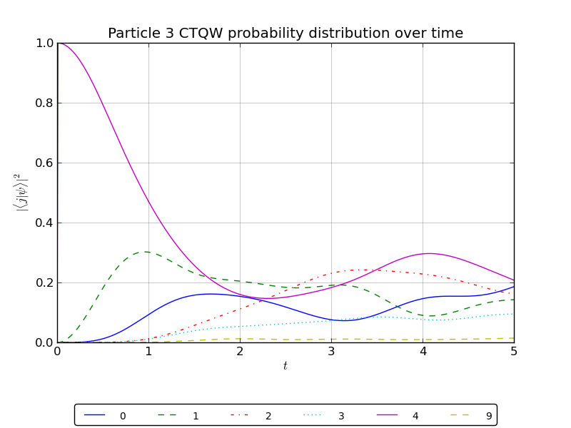
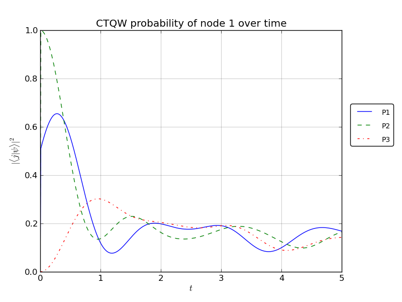

=====================
:file:`3P_3cayley.py`
=====================

Description
------------

+-----------------------+-------------------------------------------------------------------------------------+
|                       |This example propagates a 3 particle continuous-time quantum walk on a 3-cayley tree.|
|.. image:: 3cayley.png |                                                                                     |
|    :width: 300pt      |                                                                                     |
|                       |Amongst the features used, it illustrates:                                           |
|                       |    *   recieving command line options using PETSc                                   |
|                       |    *   the use of the chebyshev algorithm, with minimum eigenvalue pre-set          |
|                       |    *   adding a diagonal defect to various nodes                                    |
|                       |    *   same-node interactions between particles                                     |
|                       |    *   creating node handles to watch the probability at specified nodes            |
|                       |    *   creating entanglement handles to watch the entanglement                      |
|                       |    *   various plotting abilities:                                                  |
|                       |            - probability vs node plots                                              |
|                       |            - probability vs time plots                                              |
|                       |            - graph plots                                                            |
|                       |            - entanglement plots                                                     |
+-----------------------+-------------------------------------------------------------------------------------+

Output
------------

Required Files
-----------------
    * :download:`Adjacency matrix </../graphs/cayley/3-cayley.txt>`

Source Code
--------------------------------------------------------
[:download:`Download source code </../examples/3P_3cayley.py>`]

.. literalinclude:: /../examples/3P_3cayley.py
    :linenos:

