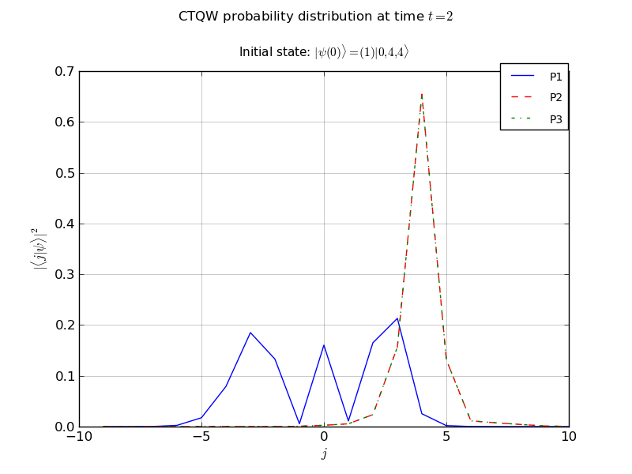

==================
:file:`3P_line.py`
==================

Description 
-----------

This example propagates a 3 particle continuous-time quantum walk on an infinite line

Amongst the features used, it illustrates:
    *   recieving command line options using PETSc 
    *   the use of the chebyshev algorithm
            - setting the EigSolver tolerance, as well as the minimum eigenvalue
    *   adding a diagonal defects to various nodes
    *   same-node interactions between particles
    *   probability vs node plot
    *   Exporting the final state to a PETSc binary vector file

Output
------------

Source Code
-------------

[:download:`Download source code </../examples/3P_line.py>`]

.. literalinclude:: /../examples/3P_line.py   
    :linenos:
